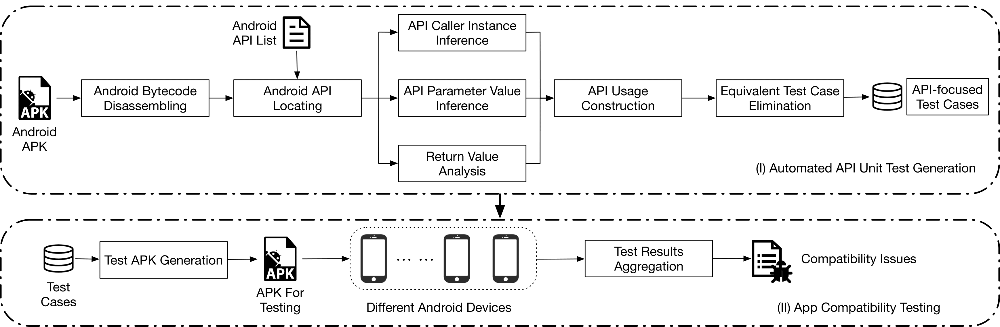

# JUnitTestGen
Despite being one of the largest and most popular projects, the official Android framework has only provided test cases for less than 30% of its APIs.
Such a poor test case coverage rate has led to many compatibility issues that can cause apps to crash at runtime on specific Android devices, resulting in poor user experiences for both apps and the Android ecosystem.
To mitigate this impact, various approaches have been proposed to automatically detect such compatibility issues.
Unfortunately, these approaches have only focused on detecting signature-induced compatibility issues (i.e., a certain API does not exist in certain Android versions), leaving other equally important types of compatibility issues unresolved.

Thus, we propose a novel prototype tool, JUnitTestGen, that mines existing Android API usages to generate API-focused unit test cases automatically for pinpointing potential compatibility issues caused by the fast evolution of the Android framework. Experimental
results on thousands of real-world Android apps show that (1) JUnitTestGen is capable of automatically generating valid unit test cases for Android APIs with an 80.4% success rate; (2) the automatically generated test cases are useful for pinpointing APIinduced
compatibility issues, including not only signature-based but also semantics-based compatibility issues; and (3) JUnitTestGen outperforms the state-of-the-practice test generation tool, EvoSuite, and the state-of-the-art static compatibility detection tool, CiD, in pinpointing compatibility issues.

Our paper has been accepted at ASE 2022.

## Approach
The following figure outlines the process of JUnitTestGen, which is made up of two modules involving a total of nine steps. We first locate target API invocations after disassembling the APK bytecode. We
then apply inter-procedural data-flow analysis to identify the API usage, including API caller instance inference and API parameter value inference. We then execute these generated test cases on
Android devices with different Android versions (i.e., API levels). The following elaborates on the detailed process of each module. The first module, Automated API Unit Test Generation, includes  five sub-processes to automatically generate unit test cases for Android APIs. This module takes as input an Android API (or an
API list) for which we want to generate unit tests and an Android app that invokes the API and outputs a minimum executable code snippet involving the given API. This code snippet is the API’s unit
test case.

The second module, App Compatibility Testing, includes two subprocesses. This module takes as input the previously generated unit test cases to build an Android app, allowing direct executions of the test cases on Android devices running different framework versions (i.e., API levels). The output of this second module is the
execution results of the test cases concerning different execution environments. Using this, JUnitTestGen can then determine all the Android APIs suffering from potential compatibility issues.

## Setup
The following is required to set up JUnitTestGen:
* MAC system
* IntelliJ IDEA

##### Step 1: Load dependencies to your local repository
* git clone git@github.com:SMAT-Lab/JUnitTestGen.git
* cd junittestgen
* ./res/loadDependencies.sh

##### Step 2: build package：
mvn clean install

##### Step 3: example of running JUnitTestGen(3 parameters):
* Parameters are needed here: [your_apk_path.apk],[path of android platform],[path of result.csv]
* Example: your_path/905a4f82bc194334a046afa9bf29eed7.apk, ~/Library/Android/sdk/platforms, your_path/result.csv
       
## Output
* Refer to sootOutput/ folder to check all the generated test cases.
* Refer to [path of result.csv] to check the map of test case name and its corresponding targetAPI.
